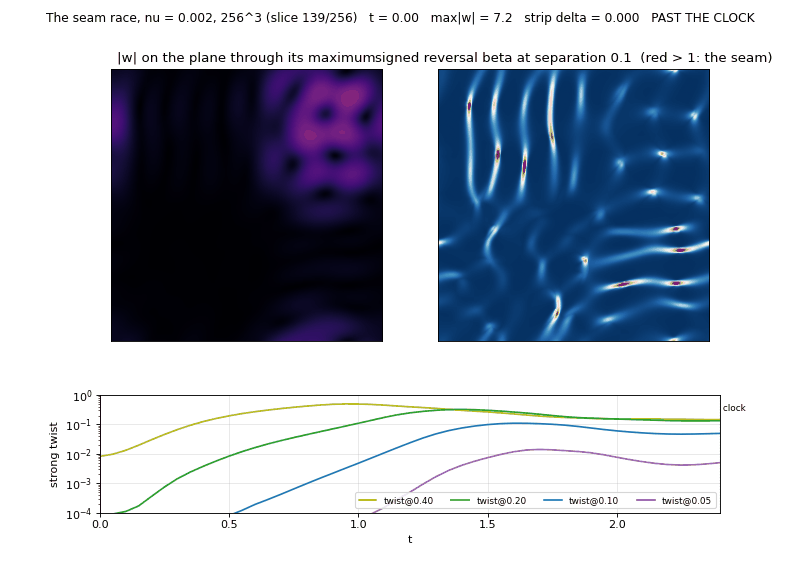
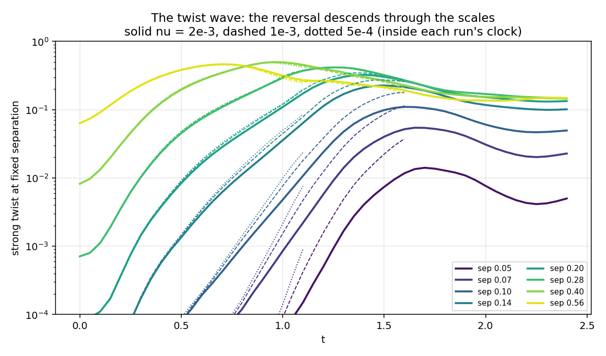
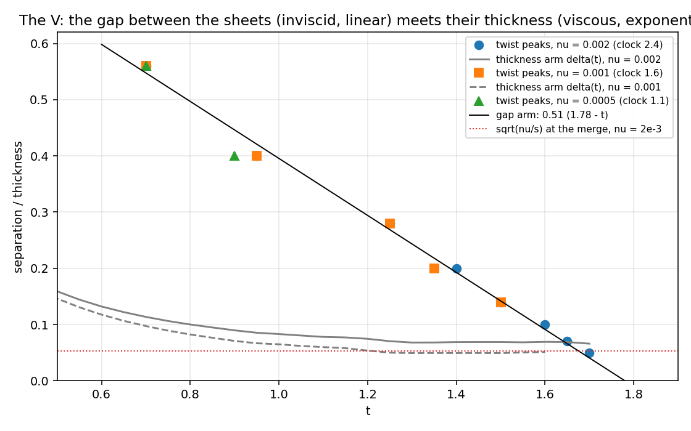
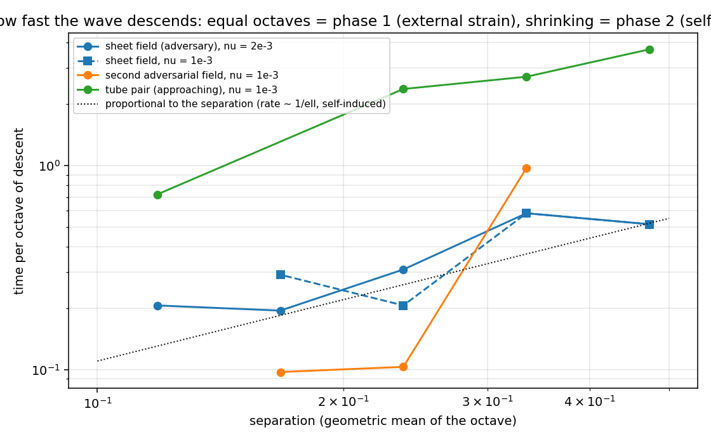

# navier-stokes-solution-search

A search, not a solution: an instrument for the mechanism of singularity formation in incompressible flow, and an
honest log of what it found. (Formerly `zero-entropy-flow`, after the solver's defining property.)

One pseudo-spectral solver for the Navier-Stokes family in 1-D, 2-D and 3-D whose own numerical dissipation is zero
(skew transport exactly energy-conserving on the grid, viscosity an exact per-mode contraction), a differentiable copy
of it that searches initial data adversarially, a higher-resolution verifier with a clock that says when to stop
believing a number, and a GPU port certified against the numpy original. Every claim on these pages was registered
before its run and is scored against that registration in `CLAIMS.md` - twenty-four so far, about half retracted in
public. Nothing here claims anything about the regularity of 3-D Navier-Stokes.

**Ten-minute version:** [`docs/NOTE.md`](docs/NOTE.md) - one structure, five numbers, one theorem, one lemma, one open bound.

**Read in this order:** this page - [`docs/GLOSSARY.md`](docs/GLOSSARY.md) (every symbol, measure and claim number,
one line each) - [`docs/MAP.md`](docs/MAP.md) (the view from above) - [`CLAIMS.md`](CLAIMS.md) (what was predicted, what
happened) - [`docs/LOG.md`](docs/LOG.md) (the full chronological log, 1200 lines, with every table) - [`THEORY.md`](THEORY.md)
(the propositions proved, the theorem that bounds the method, and the race theorem).

## The standard

- **Registered.** A prediction is written down, with the observation that would refute it, before the run.
- **Clocked.** A 3-D number is reported only while the analyticity-strip width exceeds two grid spacings; past that it
  is not a number, and the page says so. This discarded the most exciting rows this repository ever produced.
- **Retracted in the open.** Wrong predictions stay on the page with the word "wrong" next to them.
- **Cross-checked.** Two solvers (numpy, PyTorch/GPU), two precisions, same growth to three digits; energy 1.000000.



*The seam race, nu = 2e-3, 256^3, t = 0 to 2.4. Left: |w| on the plane through its maximum - the sheets fold and roll
up. Right: the signed reversal beta at separation 0.1; red is antiparallel - the seams, along the folds. Below: the
strong twist at four separations descending in turn, the frame's time in red, the clock dotted. `seam_gif.py` from the
snapshot run.*



*The twist measured at eight fixed separations on the adversary's sheet field, 256^3. Each separation's reversal
rises and falls in turn as the seam passes through it; the dashed and dotted curves (nu = 1e-3, 5e-4) lie on the solid
ones (2e-3) until their clocks expire. `plot_seam.py` from the run logs.*

## What it found, unforced

1. **Growth builds sheets, and the sheets are sub-singular in every view.** The adversary's fastest fields are
   antiparallel vortex sheets; their dissipation concentrates like a sheet (CKN exponent ~4, a singularity needs ~1),
   their strip decays as a smooth flow's, their coherence is preserved, and the pressure they recruit is global.
2. **Every energy-class candidate for a monotone-dominating quantity fails, for a structural reason.** Learned
   functionals with a passed 2-D control, topology, helicity, memory functionals, the twist: each lands in the
   dominating set and never in the monotone one. In 1-D Burgers the two sets are disjoint and it shocks; in 2-D they
   intersect and it is regular; in 3-D no member of both was found in any family tried. Tao's theorem says why.
3. **The twist helps growth and is not necessary for it.** Forbidding strong antiparallel reversals cut attainable
   growth by 30% at 64^3 (a registered 50% was refuted) and produced the first resolved found fields (1.19, 1.52, 2.24x).
   Denied the twist the searcher walks to the helicity plateau, where stretching dies.
4. **The seam descends through the scales as a wave, and the descent is a measurable inviscid law.** Twist measured at
   fixed separations peaks in sequence 0.56, 0.40, ..., 0.05; the peak times agree across nu = 2e-3, 1e-3, 5e-4 within
   one sampling step; the time per octave shrinks from ~0.55 to ~0.25 - rhythmic in the collapse's own clock,
   accelerating in ours; gap = 0.51 (1.78 - t). A hand-built tube pair shows the two phases in one run (3.7, 2.7, 2.4
   then 0.6-0.7 per octave). A second adversarial field descends in one abrupt step. Kida-Pelz shows no wave.
5. **The V.** The gap arm (inviscid, linear) meets the thickness arm (viscous, exponential) at t = 1.69-1.72, and the
   meeting scale sits on sqrt(nu/s) at both viscosities (0.052 vs 0.051 at 2e-3; 0.031 vs 0.028 at 1e-3, 320^3): the
   merge is the cut. An earlier reading that the merge sits above the viscous scale at 1e-3 came from a thickness fit
   through the post-merge plateau and is retracted. The seam descends inviscidly and merges exactly where viscosity
   can cut it; the merge scale itself tracks sqrt(nu/s) as nu falls.
6. **Kelvin's frame: the gap closes linearly and the velocity jump is bounded.** Fluid tagged on both sheets at
   t = 1.0 and followed: the material gap closes with lambda = 0.99 at both nu = 2e-3 and 1e-3, its minimum coinciding
   with the Eulerian V to 0.04; the velocity jump across the pair rises by at most 9% before the merge and is the same
   at both viscosities (~0.95 at the merge); the material vorticity turns over and falls as the cut acts. C25 (the wall,
   located) holds along two solutions. An Eulerian estimator, Re_seam, had suggested the jump grows as nu falls (C21's
   KILL); the direct measurement says it does not, and the interpretation is withdrawn.
7. **The quantum control.** In Gross-Pitaevskii the same antiparallel pair reconnects at a fixed floor (the healing
   length) with the literature's gap law, and never returns; every regulator nature offers is a fixed length, and
   Navier-Stokes' only one, sqrt(nu/s), moves with the flow. The gap between them is a quarter of a Laplacian
   (regularity is a theorem for (-Delta)^alpha, alpha >= 5/4).




*Above: the gap between the sheets (peak times of the twist, all three viscosities on one line) and their thickness
(the analyticity strip) meet at t ~ 1.7 at sqrt(nu/s). Below it: how fast the wave descends - the sheet field near the
self-induced law (time per octave proportional to the separation), the second field in one step, the tube pair slow
then fast.*

## What it found, forced

8. **A steady smooth force does not carry the seam through the floor.** Fefferman's (C)/(D) admit a smooth f; with
   f = eps x (the initial field's large scales) held on, resolved to T = 3 at nu = 2e-3, the twist still peaks at t = 1.4
   and falls 59%, the seam is cut as unforced (cut fraction 0.3-0.5, race variable never below 1.2) - and growth
   continues anyway, by re-supply: the pumped large scales rebuild seams and max|w| climbs to 9.9x and rising (unforced:
   5.7x, peak and decay), Z 7.2, energy 2.5x. A driven flow, not a collapse. C24 refuted as registered, and the
   refutation clause is the finding: a forced blow-up needs a force that tracks the collapse in space and time, which
   is how the Córdoba-Martínez-Zoroa forces are built. "Push harder" is not the route; "push exactly where the
   self-similar solution needs it" is.


*The solver itself: 2-D decaying turbulence, energy on every frame decaying only by the physical viscous rate. The
earlier figures (Burgers blow-up, 3-D stretching converging upward, Tao's wall, the helicity threshold, the Jacobi
ladder, the strip decay) are in `docs/LOG.md` and `figures/`.*

## The structures, and where each stands

The premise of this repository is that the problem will be understood through its structures before it is proved
through its norms. These are the ones found, with what was measured about each and what remains.

```
structure         what it is                            measured                                   open
sheet             the adversary's fastest object;       CKN exponent ~4 (sub-singular); strip      whether anything sharper is
                  nilpotent, pressed and narrowed       decays smoothly; coherence preserved       reachable resolved (ckn: unresolved)
seam              two sheets antiparallel; |w| -> 0     growth needs the strong reversal at 32^3,  the seam race at Re > 1500
                  across it; Biot-Savart cancels        adds ~40% at 64^3; every literature
                  there; KH rolls it; viscosity cuts it candidate sits on one
twist wave        the reversal descending through the   inviscid (peak times agree across nu to    the Lagrangian frame (Kelvin);
                  scales                                 one step) when fast; accelerating,         more seeds
                                                         gap = 0.51 (1.78 - t); tube pair shows
                                                         both phases; Kida-Pelz shows none
two phases        external squeeze (equal octaves,      3.7/2.7/2.4 then 0.6-0.7 per octave on     whether phase 2's law persists
                  stopped at sqrt(nu/s)) then self-     the pair; sheet field already in phase 2   below the clock
                  induced roll-up (shrinking octaves)
thickness arm     the analyticity strip; the sheets'    exponential, viscous (e-fold shifts        its law in Euler
                  own thickness                          with nu), never zero on its own
the V             gap arm meets thickness arm; the      t = 1.69-1.72; meeting scale on sqrt(nu/s)   the 5e-4 rung (~450^3)
                  pair merges before the gap closes     at BOTH nu (320^3): merge = cut; Lagrangian
                                                         gap minimum at 1.65 / 1.70 agrees
the jump          velocity difference across the pair,  bounded along each solution (x1.09, x1.08)  more fields; the tracking
(C25)             the quantity that would have to blow   and the same at both nu; Re_seam's x2.65     force
                  up for the seam to be a singularity    was the estimator, withdrawn
the floor         the one fixed length a fluid has      GPE: healing length, cut on contact;       -
                                                         NS: sqrt(nu/s), moves with the flow;
                                                         Euler: none; forced: replenished budget,
                                                         still cut, growth by re-supply
```

`docs/MAP.md` is the same table with the reasoning around it, and the list of what is closed.

## The field on 2026-09-08

Buckmaster and Alpöge posted Lean-verified finite-time blow-up *with smooth forcing* for 3-D Euler (and Boussinesq,
IPM), on the Córdoba-Martínez-Zoroa program. OpenAI reported to them, unseen, a forced Navier-Stokes blow-up on R^3
and T^3 - Fefferman's statements (C)/(D), which admit a smooth force and are the Clay problem's breakdown direction.
Ganeshram, Duruisseaux and Anandkumar posted evidence with a proof framework for an unforced, travelling, axisymmetric
self-similar Euler singularity on R^3 (swirl-driven, in Luo-Hou's variables; profile not yet public). None of these
answers the unforced physical question, (A)/(B); a smooth force replenishes the budget that makes the unforced
collapse "free but unpaid for". This repository's forced seam race (C24) watches how; its unforced results stand as
measurements of the mechanism the fluid has on its own. Details: `docs/LOG.md`, "The field on 2026-09-08".

## The structures

Sheet, seam, twist wave, thickness arm, viscous floor, V - and the two phases: external squeeze that the budget stops
at sqrt(nu/s), and self-induced roll-up the budget cannot price. `docs/MAP.md` puts them next to each other.

## Run one thing

```
pip install numpy torch matplotlib
python burgers_entropy.py                       # 1-D: the blow-up an integrator with zero numerical entropy can see (seconds)
python monotone_vs_dominating.py                # 1-D and 2-D: the two sets, disjoint then intersecting (a minute)
NU=2e-3 N=32 T=1.2 python seam_race.py          # the seam race at 32^3 with the strong-twist column (seconds)
DMIN=0.30 TWISTW=10 N=32 ITERS=60 NVER=128 python adversarial_ic.py     # forbid the twist (CI-scale, ~10 min)
IC=found N=64 NU=2e-3 T=3 python kaggle/seam/seam_gpu.py                 # the seam race, GPU or CPU, any N
```

Every script is standalone, reads the found fields from `results/found/`, and prints its registered verdict.
`docs/SCRIPTS.md` lists all 43 by theme with their result files; `.github/workflows/experiments.yml` runs them on CI
(`which=<job>`); `results/README.md` indexes the 170 result files.

## Boundaries

Resolution: 256^3 on a T4, Re ~ 500-1500 - small by modern standards and the Euler clock expires at t ~ 0.9 even
there. Data: mostly one adversarial field, one seed; the generality runs (Kida-Pelz, a second field, a tube pair) are
one day old. The instrument measures; it does not prove. Its contribution is the map and the standard.

Issues and Discussions are open. Refutations welcome; bring the output.
